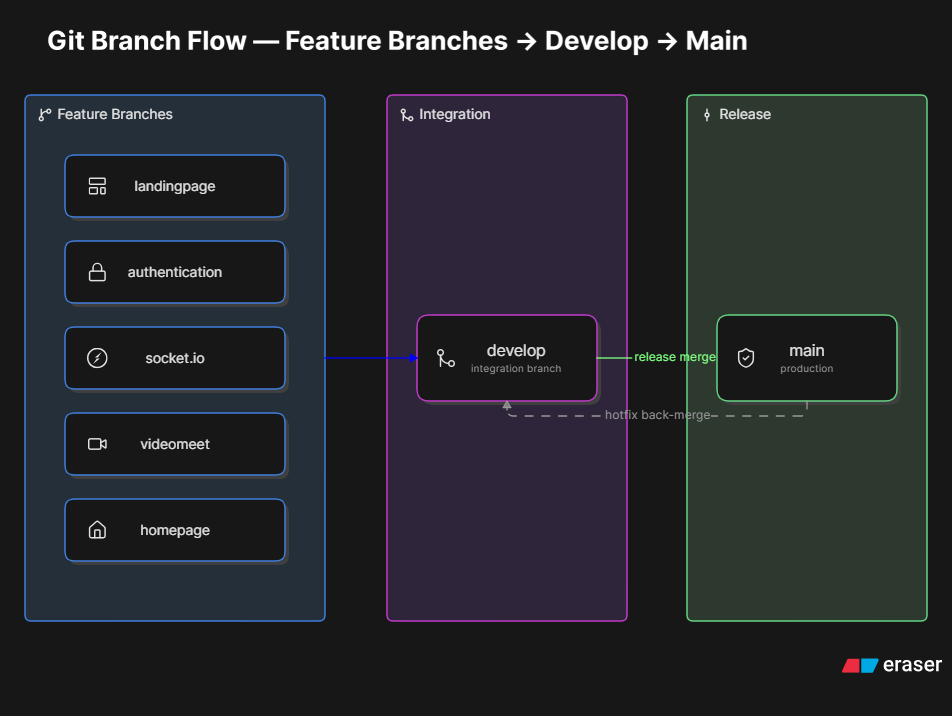
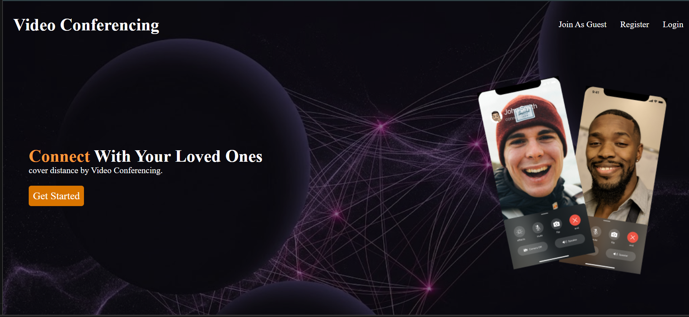
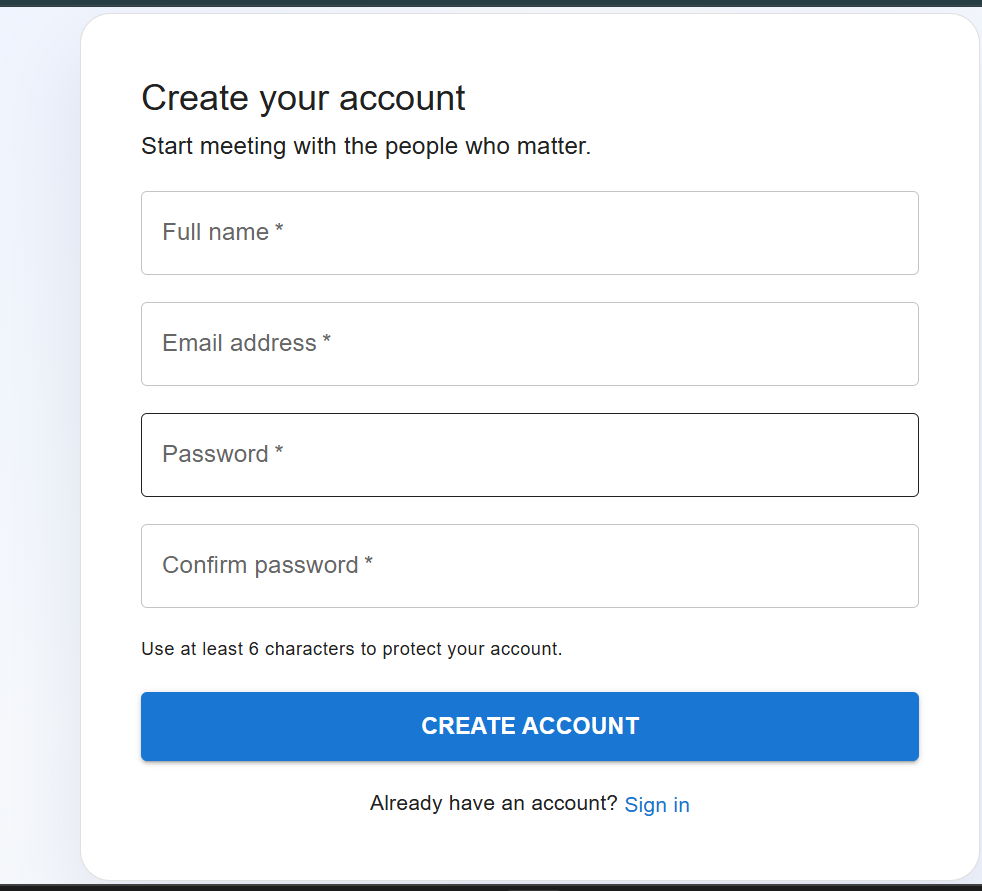
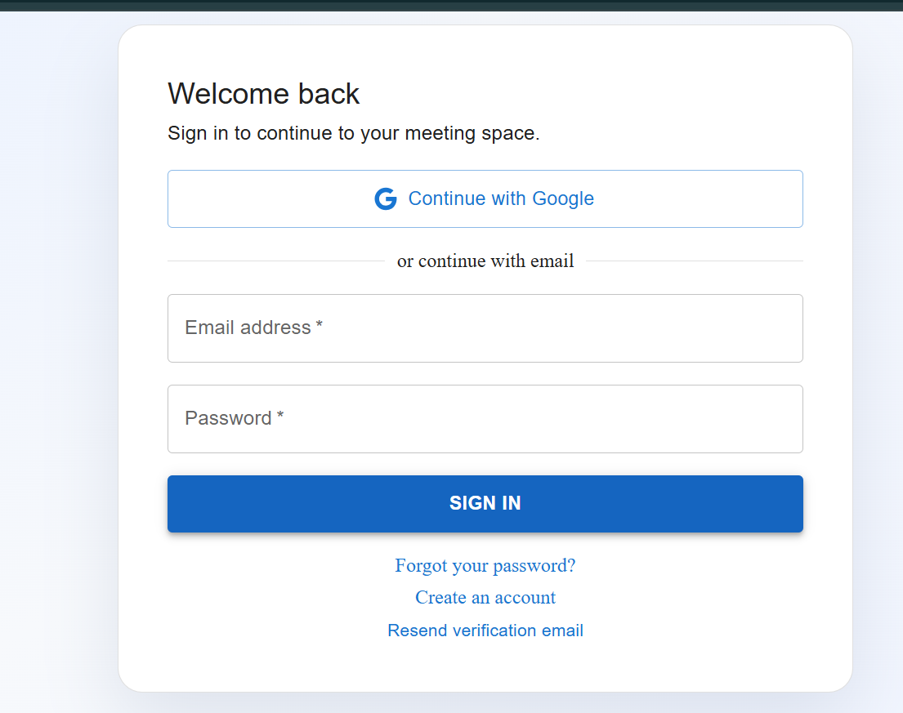
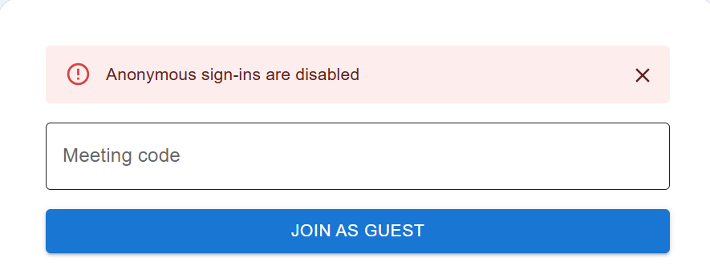
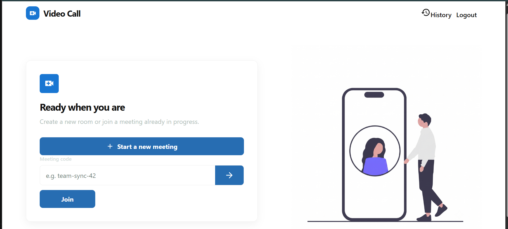
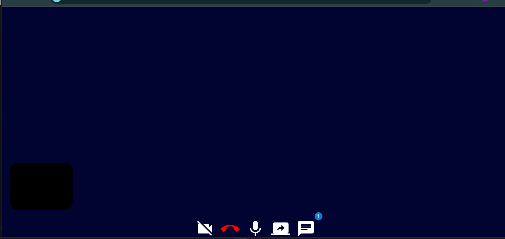
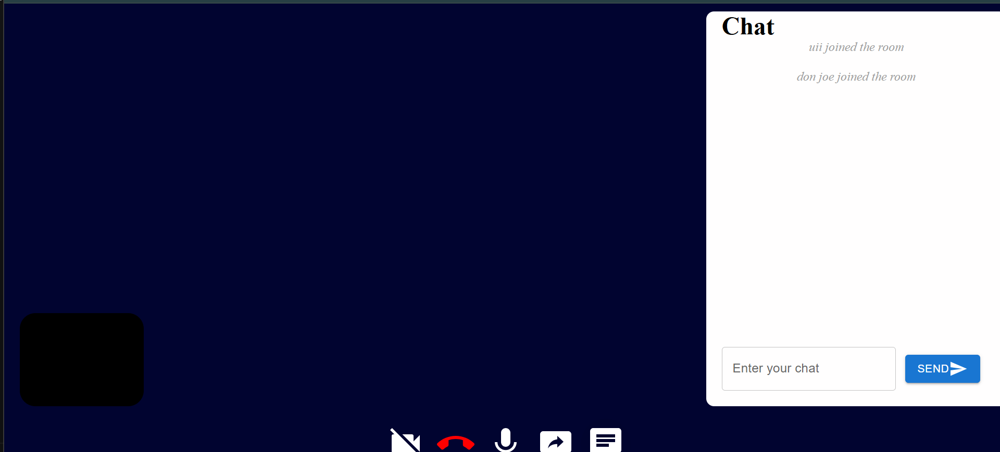
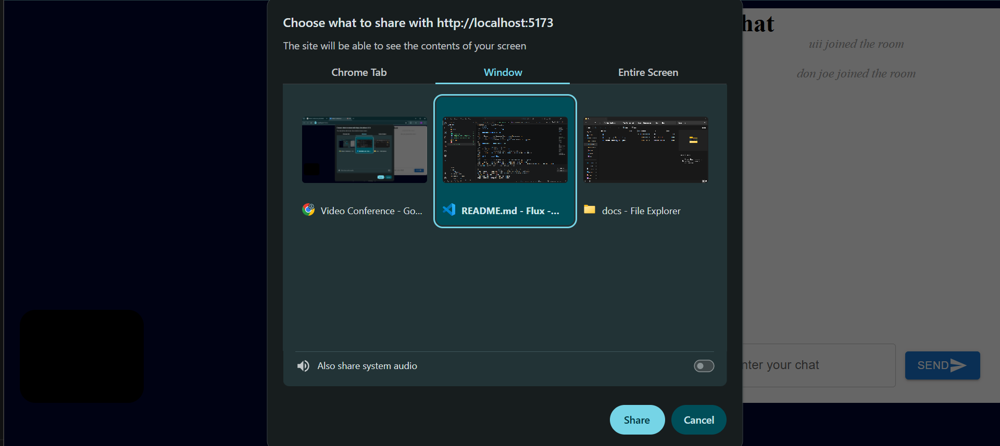

## Flux - Full-Stack Video Meeting Application

Flux is a full-stack video meeting application with Supabase authentication, real-time signaling, and WebRTC-based video calls. It includes email/password sign-in, Google OAuth, guest access, protected routes, and a real-time meeting experience.

## Features

- Supabase authentication with email/password and Google OAuth
- Anonymous guest sessions for quick meeting access
- Protected frontend routes and backend auth checks
- Real-time video meetings using WebRTC and Socket.IO
- Screen sharing and in-call chat
- Meeting history and user-specific meeting flows

## Tech Stack

- Frontend: React, Vite, Material UI,Vanila Css
- Backend: Express.js, Socket.IO, Prisma , Node.js
- Authentication: Supabase Auth
- Real-time media: WebRTC

## Project Structure

- frontend: React client app
- backend: Express server and Socket.IO signaling server
- prisma: database schema and migrations

## Prerequisites

Before you start, make sure you have:

- Node.js 18 or newer
- npm or pnpm
- A Supabase project
- A browser that supports WebRTC and media devices

## 1. Clone and install dependencies

```bash
git clone <your-repo-url>
cd Flux

cd backend
npm install

cd ../frontend
npm install
```

## 2. Configure Supabase Auth

Create a Supabase project and enable the authentication providers you want to use.

### Required Supabase settings

In your Supabase dashboard:

1. Go to Authentication > Settings
2. Enable Email authentication
3. Enable Google OAuth if you want Google sign-in
4. Set your app URL and redirect URLs

### Recommended local redirect URLs

- http://localhost:5173/auth
- http://localhost:5173

### Supabase environment variables

Create environment files for both apps.

Backend environment variables:

```env
# backend/.env
SUPABASE_URL=https://<your-project-ref>.supabase.co
SUPABASE_SERVICE_ROLE_KEY=<your-service-role-key>
PORT=5000
```

Frontend environment variables:

```env
# frontend/.env
VITE_SUPABASE_URL=https://<your-project-ref>.supabase.co
VITE_SUPABASE_ANON_KEY=<your-anon-key>
VITE_API_URL=http://localhost:5000
VITE_SIGNALING_SERVER_URL=http://localhost:5000
```

> Never commit your real Supabase keys to GitHub. Keep them in local environment files only.

## 3. Run the applications

Start the backend:

```bash
cd backend
npm run dev
```

Start the frontend:

```bash
cd frontend
npm run dev
```

The frontend will usually run at:

- http://localhost:5173

The backend API and signaling server will run at:

- http://localhost:5000

## 4. How authentication works

The app uses Supabase Auth for:

- Sign up and sign in with email/password
- Google OAuth sign-in
- Guest sign-in via anonymous sessions
- Session persistence in the browser

The frontend uses the Supabase client directly, while the backend validates requests using the access token and Supabase authentication.

## 5. How the video calling feature works

Flux uses WebRTC for peer-to-peer video and audio streaming. Socket.IO is used only for signaling, which means it helps clients exchange connection details, not the actual media stream.

### WebRTC basics

- WebRTC lets browsers connect directly and exchange audio, video, and screen-share data.
- A signaling server is needed to exchange metadata before a direct connection can be established.
- In this project, the Express + Socket.IO server handles that signaling step.

### STUN servers

A STUN server helps each peer discover its public IP address and port so it can connect through NAT routers.

The app currently uses:

```js
stun:stun.l.google.com:19302
```

This is a public STUN server for development and testing. In production, you should use a reliable STUN/TURN provider for better connectivity, especially on mobile networks or strict corporate networks.

### ICE

ICE stands for Interactive Connectivity Establishment. It is the framework that helps peers find the best path to connect.

ICE tries several connection strategies, including:

- direct peer-to-peer connections
- connections through NAT traversal using STUN
- relay connections through TURN if direct connectivity is not possible

### SDP

SDP stands for Session Description Protocol. It is the message format used to describe media capabilities such as:

- audio/video tracks
- codecs
- transport settings
- connection details

In this app, SDP offers and answers are exchanged between peers through the Socket.IO signaling channel.

### In simple terms

1. The browser captures media.
2. A peer connection is created.
3. The client generates an SDP offer.
4. The offer is sent through Socket.IO.
5. The remote peer responds with an SDP answer.
6. ICE candidates are exchanged to establish the best connection.
7. Media begins flowing directly between peers.

## 6. Important notes for video calls

- Camera and microphone permissions are required in the browser.
- A secure HTTPS context is strongly recommended for production WebRTC.
- If you see connection issues, check:
  - browser permissions
  - firewall/NAT settings
  - STUN/TURN configuration
  - correct signaling server URL

## 7. Common troubleshooting

### Supabase auth errors

- Check that your Supabase URL and anon key are correct
- Confirm your OAuth provider is enabled
- Ensure your redirect URLs match your local or deployed app URL

### Video call connection issues

- Make sure the backend is running
- Confirm the signaling URL is correct
- Verify that your browser allows camera and microphone access
- Try a public STUN server or a production-grade STUN/TURN service

## 8. Development tips

- Use npm run dev in both frontend and backend during development
- Keep secrets in environment files and never hard-code them
- If you deploy the app, update the Supabase redirect URLs and the signaling URL for production
## 9. Branch strategy


## 10. Screenshots









## License

This project is intended for local development and learning purposes unless otherwise stated by the repository owner.
